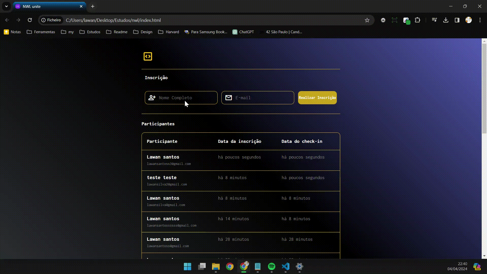

# Projeto NWL


|  |  | |
|---|---|---|

&nbsp;

## ✏️Descrição do Projeto

Este repositório foi criado como parte da trilha da Rocketseat onde explorei conceitos de extração das tabelas do Html para JavaScript com ```event```, efetuei novas formas de utilizar e simplificar a indicação de uma ```function``` e o conceito ```for``` para revisar todos itens da lista para assim poder adicionar um ou impedir caso tenha uma duplicidade.

&nbsp;

## 🎬Demonstração

<p align="center">

</p>


&nbsp;
## 📖Referências

 - [Rocketseat](https://app.rocketseat.com.br/?logout=true)
 - [Figma design](https://www.figma.com/file/a9oFmEG6VHiSQnZwBh5uYg/pass.in-(Community)?type=design&node-id=4003-2784&mode=design&t=aUKBLGJnCdmdEoT8-0)

&nbsp;

## 🚀 Sobre mim

Sou um aspirante a desenvolvedor frontend com forte interesse em HTML, CSS e JavaScript. Determinado a aprender e crescer, estou comprometido em criar experiências digitais cativantes e intuitivas. Pronto para enfrentar desafios e contribuir para projetos inovadores.

